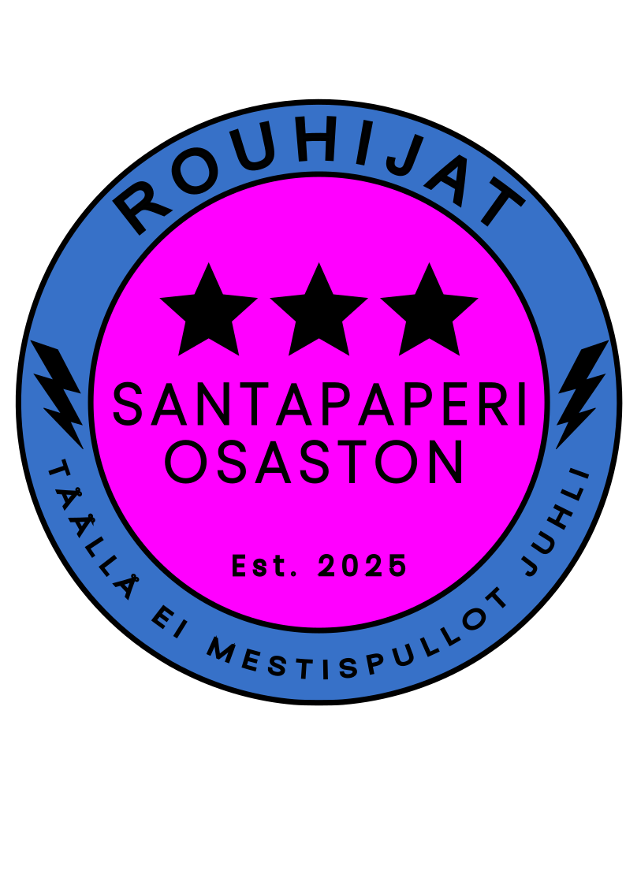

<div align="center">
  <table>
    <tr>
      <td></td>
      <td><h1>Rouhijat Project</h1></td>
    </tr>
  </table>
  <a href="https://www.rouhijat.fi"><h2>www.rouhijat.fi</h2></a>
</div>
<hr>


### A modern web application built with a Next.js frontend and Node.js backend for managing player stats, blog/history posts and games

# Table of Contents

* [Motivation](#motivation)
* [Key Features](#key-features)
* [Architecture](#architecture)
* [Project Structure](#project-structure)
* [License](#license)


# ⚡Motivation

Santapaperiosaston Rouhijat (Rouhijat for short) was built as a fun project for showcasing our team's games, stats, and "stories".

I wanted to create a modern, scalable web application using technologies that are widely adopted in the industry. This project allowed me to deepen my experience in full-stack development, cloud deployment, and secure authentication. I learned how to integrate third-party APIs, optimize for performance, and automate deployments with CI/CD.

I tackled challenging problems including secure authentication flows, optimizing image uploads and storage, implementing caching strategies with Redis, and ensuring mobile responsiveness across devices.

# 🚀 Key Features 

* Google OAuth authentication for role-based access control
* Player and game statistics tracking
* Blog/History post management with rich text editing
* Responsive design for mobile and desktop 
* Instagram feed integration

# 🏗️ Architecture

The project follows a microservices architecture with the following technologies:

## Frontend


 
 


* **Framework**: [Next.js](https://nextjs.org/) 15 (App Router)
* **Language**: [TypeScript](https://www.typescriptlang.org/)
* **Styling**: [Tailwind CSS](https://tailwindcss.com/), [Shadcn UI components](https://ui.shadcn.com/)
* **State management**: [React Context API](https://legacy.reactjs.org/docs/context.html)
* **Authentication**: [JWT](https://www.jwt.io/) with cookies
* **Text Editor**: [Tiptap](https://tiptap.dev/docs) for rich content editing and image upload capabilities
* **HTTP Client**: Custom fetch wrapper
* **Code Styling**: [ESLint](https://eslint.org/)

## Backend

 
 


* **Framework**: [Express.js](https://expressjs.com/)
* **Language**: [TypeScript](https://www.typescriptlang.org/)
* **Database ORM**: [Prisma](https://www.prisma.io/)
* **Authentication**: [Passport.js](https://www.passportjs.org/) with Google OAuth
* **Caching**: [Redis](https://redis.io/)
* **Testing**: [Jest](https://jestjs.io/) with [Supertest](https://github.com/forwardemail/supertest)
* **Security**: [Helmet](https://helmetjs.github.io/), rate limiting, CORS
* **Code Styling**: [ESLint](https://eslint.org/)

## Infrastructure


 
 


 
 

* **Containerization**: [Docker](https://www.docker.com/), Docker compose
* **Reverse Proxy**: [Nginx](https://nginx.org/)
* **Database**: [PostgreSQL](https://www.postgresql.org/), [SQLite](https://sqlite.org/) (testing)
* **CI/CD**: [GitHub Actions](https://github.com/features/actions)
* **Hosting**: [Oracle](https://www.oracle.com/cloud/) VM deployment
* **DNS**: [Cloudflare](https://www.cloudflare.com/) for managing Domain Name Service  


# 🛠️ Project Structure

### Frontend

```
/app            # Next.js pages and routes
/components     # React components
/context        # React context providers
/hooks          # Custom React hooks
/public         # Static assets
/css            # CSS files
/types          # TypeScript type definitions
/utils          # Utility functions
```

### Backend

```
/controllers    # API route handlers
/services       # Business logic
/utils          # Helper functions
/prisma         # Database schema and migrations
/tests          # Jest test suite
/media          # Uploaded media files
```


# 🔑 License 

This project is licensed under the [MIT License](LICENSE).